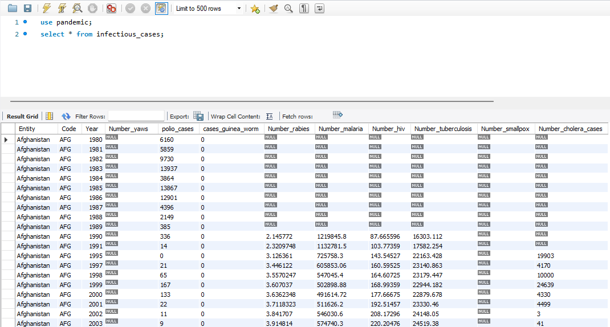
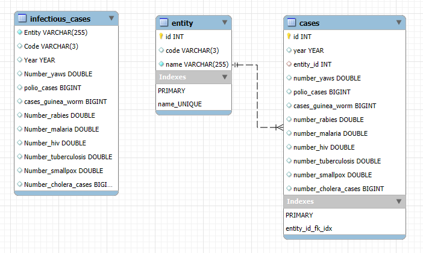
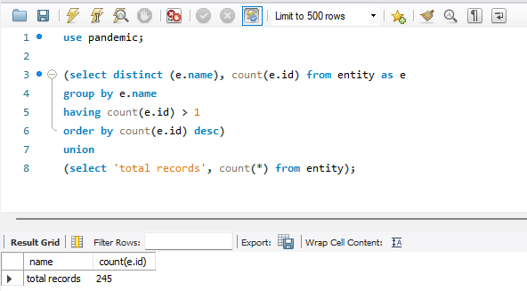
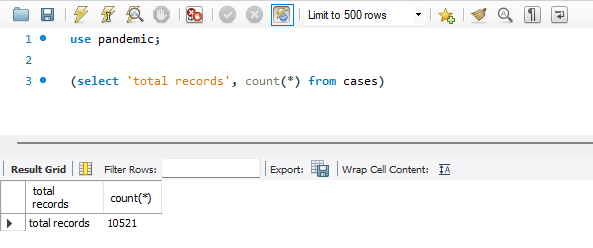
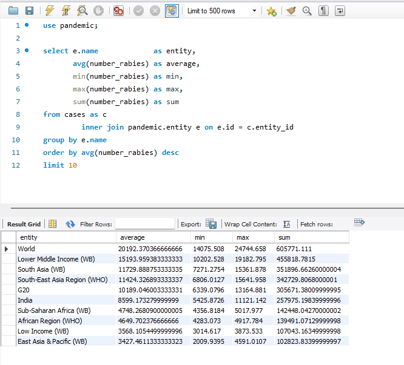
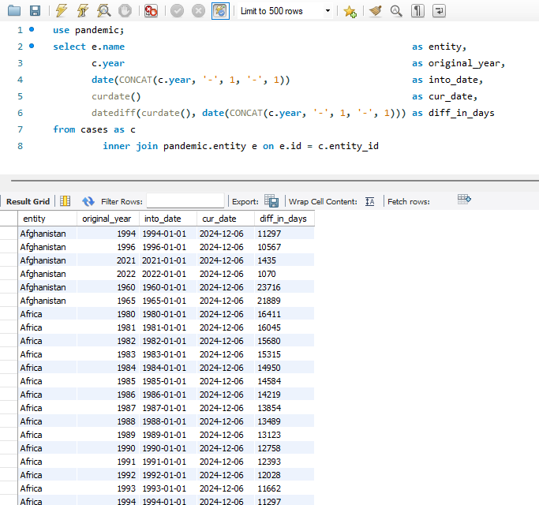
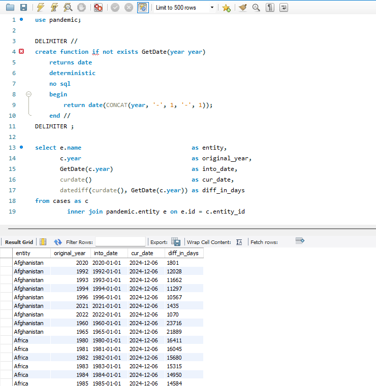

# Фінальний проєкт

## Завдання

### 1. Завантажити дані:

Створити схему pandemic у базі даних за допомогою SQL-команди.
Оберати її як схему за замовчуванням за допомогою SQL-команди.
Імпортувати дані за допомогою Import wizard так.

[DDL таблиці pandemic.infectious_cases](p1_ddl.sql)

### 2. Нормалізація таблиці infectious_cases до 3ї нормальної форми. Зберегти у цій же схемі дві таблиці з нормалізованими даними.

[DDL нових таблиць](p2_ddl.sql)

[DML запити](p2_dml.sql)

#### Перевірки

### 3. Проаналізувати дані:

Для кожної унікальної комбінації Entity та Code або їх id порахувати середнє, мінімальне, максимальне значення та суму для атрибута Number_rabies.

* імпорт та міграція були здійснені таким чином, що пусті рядки були трансформовані в NULL

Результат відсортувати за порахованим середнім значенням у порядку спадання.
Оберати тільки 10 рядків для виведення на екран.

[DQL запит](p3_dql.sql)

### 4. Побудувати колонку різниці в роках.

Для оригінальної або нормованої таблиці для колонки Year побудувати з використанням вбудованих SQL-функцій:

атрибут, що створює дату першого січня відповідного року,
атрибут, що дорівнює поточній даті,
атрибут, що дорівнює різниці в роках двох вищезгаданих колонок.

[DQL запит](p4_dql.sql)

### 5. Побудувати функцію.

Створити і використати функцію, що будує такий же атрибут, як і в попередньому завданні: функція має приймати на вхід значення року, а повертати різницю в роках між поточною датою та датою, створеною з атрибута року (1996 рік → ‘1996-01-01’).

[DQL запит](p5_dql.sql)

